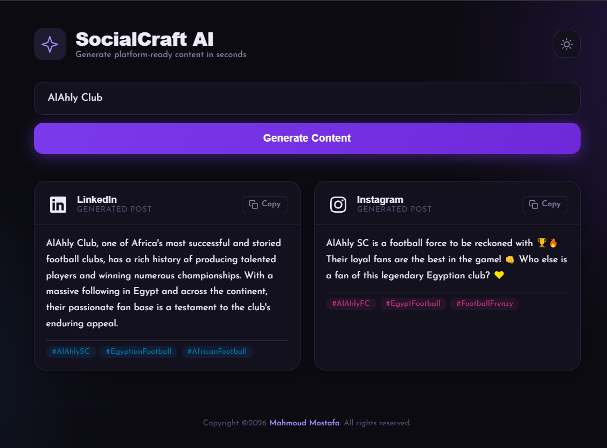
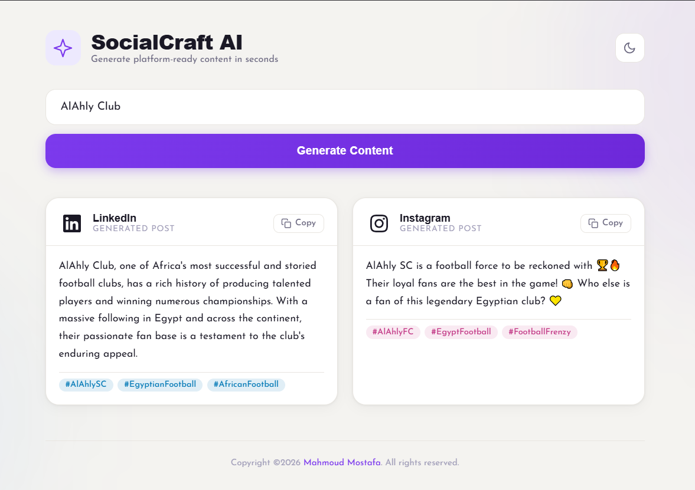

# SocialCraft AI

> AI-powered social media content generator — type a topic, get LinkedIn & Instagram posts instantly.


---

## 📸 Screenshots

### Dark Mode



### Light Mode



---

## 🧠 How It Works

```bash
User types a topic
       ↓
React App  →  POST /webhook/social-agent
       ↓
n8n: AI Agent (Groq / Llama 3.1)
       ↓
Code Node — JSON.parse(output)
       ↓
{ linkedin: "...", instagram: "..." }
       ↓
React displays both posts
```

---

## 🏗️ Tech Stack

| Layer     | Tool                          |
| --------- | ----------------------------- |
| Frontend  | React + Vite + CSS            |
| Workflow  | n8n cloud                     |
| LLM       | Groq — `llama-3.1-8b-instant` |
| Transport | REST Webhook                  |

---

## 📁 Project Structure

```bash
social-craft-ai/
├── Social Craft AI n8n workflow.json
├── socialCraftAi/
│   ├── src/
│   │   ├── hooks/
│   │   │   ├── useTheme.js
│   │   │   └── useSocialAgent.js
│   │   ├── components/
│   │   │   ├── icons/
│   │   │   │   ├── index.js
│   │   │   │   ├── SunIcon.jsx
│   │   │   │   ├── MoonIcon.jsx
│   │   │   │   └── SparkleIcon.jsx
│   │   │   ├── Header.jsx
│   │   │   ├── Footer.jsx
│   │   │   ├── TopicForm.jsx
│   │   │   ├── ResultsSection.jsx
│   │   │   ├── PostCard.jsx
│   │   │   └── SkeletonCard.jsx
│   │   ├── App.jsx
│   │   ├── App.css
│   │   └── main.jsx
│   ├── index.html
│   ├── vite.config.js
└── └── package.json
```

---

## ⚙️ Setup

### 1. Clone

```bash
git clone https://github.com/MahmoudMostafa11199/social-craft-ai.git
cd social-craft-ai
```

### 2. Install & run

```bash
npm install
npm run dev
```

Open [http://localhost:5173](http://localhost:5173)

---

## 🔄 Workflow Nodes

```text
Webhook  →  AI Agent (Groq)  →  Code Node  →  Respond to Webhook
```

---

## ✨ Features

- 🌙 Dark/Light mode + local storage
- 📋 Copy button for each post
- 🏷️ Separate hashtags as pills
- 💀 Skeleton loader during generation
- 📱 Responsive on mobile and desktop

---

## 👤 Author

**Mahmoud Mostafa**
